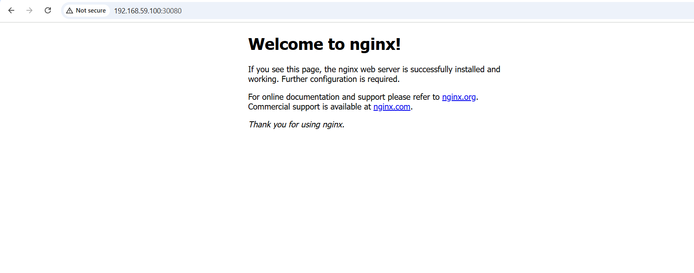

# ☸️ Single Node Kubernetes Cluster Setup with Ansible

Automate the deployment of a single node Kubernetes cluster using Ansible (Centos Stream 9 nodes).

## 🛠️ Prerequisites

- Control node: Centos Stream 9.
- Target node: Centos Stream 9.
- User with passwordless sudo privileges on the target node.

## 🔑 SSH Setup

Before running Ansible, set up passwordless SSH access from the control node to the target node:

1. **Run the SSH setup script on the control node**

   ```bash
   cd scripts
   ./setup-ssh.sh -H <TARGET-HOST-IP> -U <SSH-CONNECTION-USER>
   ```

   This script generates an SSH key pair and configures the SSH config to access host with at `<TARGET-HOST-IP>` using the user `<SSH-CONNECTION-USER>`, setting the target node hostname as `mono`. After running the script, copy the generated public key (`.pub`) to the target node's `~/.ssh/authorized_keys`.

2. **Verify SSH access from the control node to the target node**
   ```bash
   ssh mono
   ```

## 📂 Project Structure

- `ansible/playbooks/site.yaml`: Main playbook for cluster setup.
- `ansible/roles/`: Modular roles for preparing the target server, installing Kubernetes, and bootstrapping the cluster.
- `ansible/inventories/hosts.ini`: Hosts definition.
- `ansible/ansible.cfg`: Default configurations for the Ansible project.
- `scripts/setup-ssh.sh`: SSH keys setup script.

## ✨ Features

- Generates ssh keys for accessing target node (`mono`).
- Prepares the target node for installing kubernetes components (based on the official Kubernetes documentation).
- Install Kubeadm, Kubelet and containerd on the target node.
- Initialize the single-node cluster and sets the Container network interface (CNI) **Calico**.

## 🚀 Usage

1. **Clone the repository**

   ```bash
   git clone <repo-url>
   cd mono-node-k8s
   ```

2. **Set up SSH access**

   - Run `scripts/setup-ssh.sh` as described above.
   - Copy the public key generated (`.pub`) to the target node's `~/.ssh/authorized_keys`.

3. **Run the playbook**
   ```bash
   cd ansible/
   ansible-playbook playbooks/site.yaml
   ```

## 🖥️ Accessing Kubernetes

After the setup is finished, the kubeconfig file will be located in the home directory of the user running the Ansible playbook, under `~/kubeconfig`, you can copy it to your local machine, control machine or any machine where you want to interact with the cluster using kubectl or helm.

We also deployed a test Nginx application on the cluster by applying the deployment and service manifests located under `nginx-app/`:
   ```bash
   kubectl apply -f nginx-app/
   ```
The Nginx application service is configured as a `NodePort` service exposed on port `30080`. You can access it in a browser or via curl to verify that it is running.

<div align="center">
  
</div>


